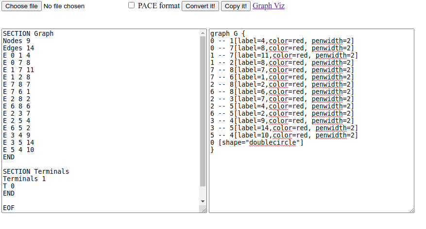
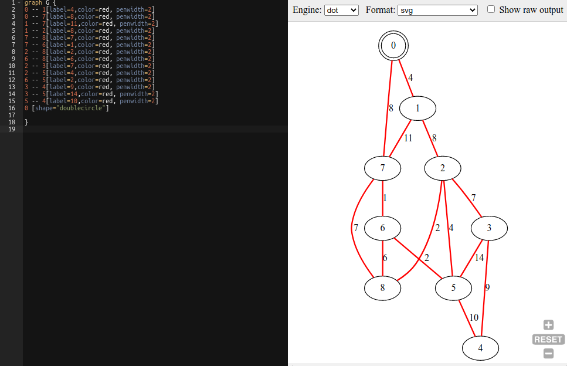
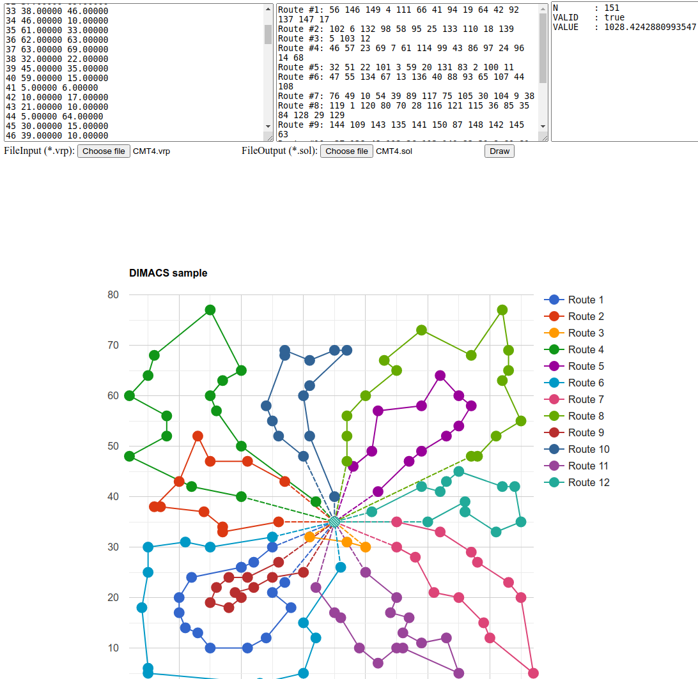

## Rajesh's tools

Welcome to [Rajesh's](https://mrprajesh.co.in/) tools. These are some of the tools that I have build for aiding my research work at IIT Madras.

### Visualization

1. [Steiner Tree](./pace.html)
2. [CVRP](./cvrp2.html)

#### Steiner Tree

Steps
1. Choose the input `.stp` file.
2. Click the `convert` button to generate graphviz text.
3. Click copy (get into your clipboard).
4. Click graphviz link biside and paste it to visualize.

#### CVRP
Steps
1. Two ways. (choose the input `.vrp` file and ouput `.sol` file) or paste the its contents  into box
2. Click draw
3. The routes are visialized below and there is check if the cost values computed matches printed cost.

### count++
<!-- hitwebcounter Code START -->

