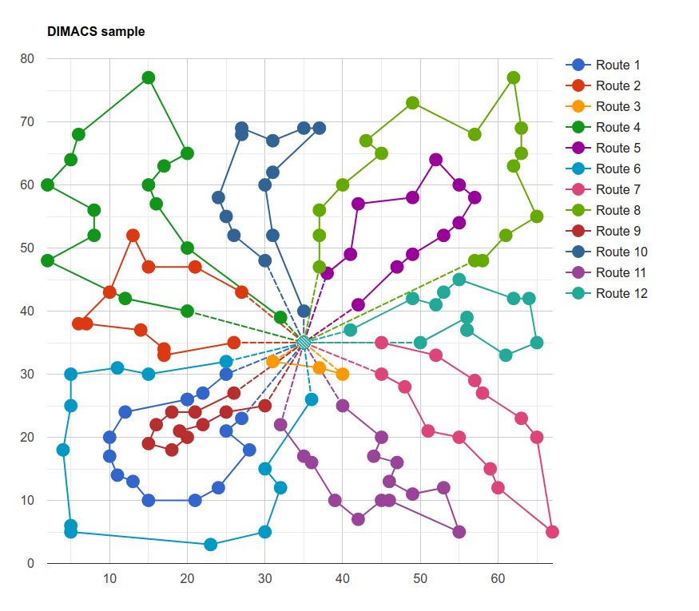

## Rajesh's tools

Welcome to [Rajesh's](https://mrprajesh.co.in/) tools. These are some of the tools that I have build for aiding my research work at IIT Madras.

### Visualization

1. [Steiner Tree](./pace.html)  // Steps [Below](#steiner-tree)
2. [CVRP](./cvrp2.html)         // Steps [Below](#cvrp)

#### Steiner Tree

Steps
1. Click on [STP tool page](https://mrprajesh.github.io/tools/pace.html)
1. Choose the input `.stp` file.
2. Click the `convert` button to generate graphviz text.
3. Click copy (get into your clipboard).
4. Click graphviz link biside and paste it to visualize.

Demo video:

#### CVRP
Steps

1. Click on [CVRP GUI tool page](https://mrprajesh.github.io/tools/cvrp2.html)
1. Two ways: choose the input `.vrp` file and ouput `.sol` file, or paste the its contents into text box.
2. Click draw button.
3. The routes are visualized below (Bonus: there is s check if the cost values computed matches printed cost).

Thanks to [CVRPLIB](http://vrp.atd-lab.inf.puc-rio.br/index.php/en/plotted-instances?data=A-n32-k5)  for the inspiration!

Demo video:

### count++
<!-- hitwebcounter Code START -->

